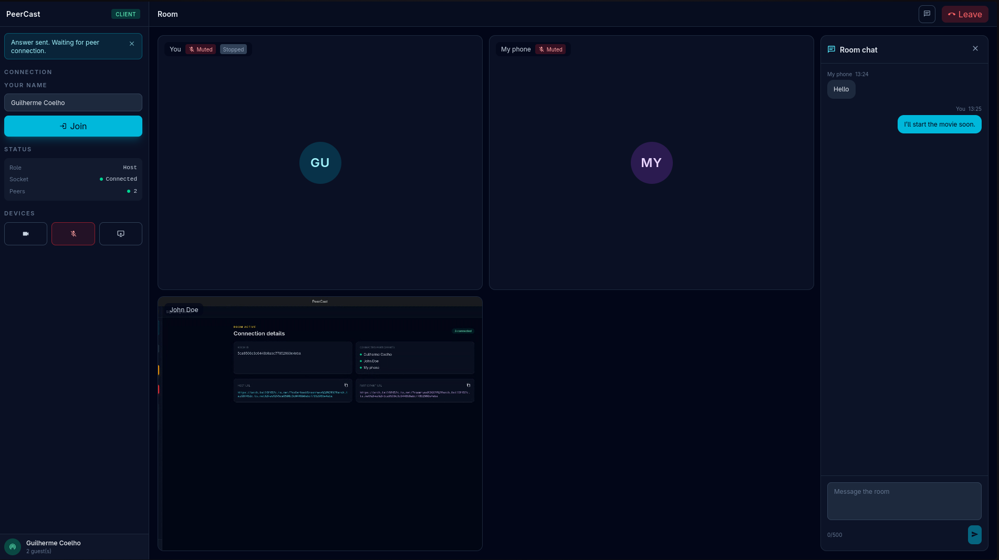

# PeerCast

<div align="center">
  
</div>

PeerCast é um app local: quem hospeda a sala executa o aplicativo no próprio computador e os convidados entram pelo navegador. Durante o compartilhamento de tela, o host escolhe a qualidade de transmissão para equilibrar resolução, FPS, bitrate e uso de rede.

As salas funcionam de forma privada através do Tailscale. Isso evita abrir portas no roteador ou expor sua máquina na internet pública.

## Qualidade de transmissão

Ao compartilhar a tela, escolha uma qualidade conforme a conexão de upload do host:

| Qualidade       | Resolução e FPS    | Bitrate alvo |
| --------------- | ------------------ | ------------ |
| Low             | Até 720p a 30 FPS  | 2,5 Mbps     |
| Balanced        | Até 1080p a 30 FPS | 5 Mbps       |
| High            | Até 1080p a 60 FPS | 8 Mbps       |
| Ultra           | Até 1440p a 60 FPS | 14 Mbps      |
| 4K Experimental | Até 4K a 30 FPS    | 20 Mbps      |

## Para quem é cada download?

**Somente o host precisa baixar o PeerCast.** O host é a pessoa que cria a sala e compartilha a própria tela/câmera.

Os convidados não instalam PeerCast. Eles precisam apenas do Tailscale conectado à mesma tailnet e de um navegador moderno, como Chrome ou Firefox.

Baixe a versão mais recente em [GitHub Releases](https://github.com/guicoelhodev/PeerCast/releases/latest):

| Sistema do host                   | Arquivo para baixar                          |
| --------------------------------- | -------------------------------------------- |
| Windows                           | arquivo `.msi` ou `-setup.exe`               |
| macOS Apple Silicon (M1/M2/M3/M4) | arquivo `.dmg` com `aarch64` no nome         |
| macOS Intel                       | arquivo `.dmg` com `x64` ou `x86_64` no nome |
| Linux                             | arquivo `.AppImage`                          |

Como o app é distribuído diretamente pelo GitHub, Windows e macOS podem exibir um alerta de aplicativo não assinado. Para uso entre amigos, confirme que o arquivo veio da página oficial de Releases acima antes de prosseguir.

## Por que o Tailscale é necessário?

O PeerCast roda no computador do host. Para os convidados alcançarem esse computador seria necessário abrir portas no roteador, lidar com IP público que pode mudar e expor o serviço à internet.

O Tailscale cria uma rede privada entre os dispositivos autorizados. Com ele:

- a sala ganha uma URL HTTPS privada, acessível apenas à sua tailnet;
- não é necessário configurar port forwarding;
- a mídia WebRTC continua criptografada e tenta seguir diretamente entre host e convidado;
- somente pessoas adicionadas à sua tailnet podem abrir a URL.

Todos que participarão — host e convidados — devem instalar o Tailscale, entrar na mesma tailnet e estar conectados antes de abrir a sala. O PeerCast não pede nem guarda credenciais do Tailscale.

## Como usar

### 1. Preparar o Tailscale

No host e em cada convidado:

1. Instale o [Tailscale](https://tailscale.com/download).
2. Entre na mesma tailnet, usando uma conta compartilhada ou convidando os amigos pelo painel do Tailscale.
3. Confirme que o status está como conectado.

No computador do host, descubra o nome MagicDNS:

```bash
tailscale status
```

Ele normalmente se parece com `meu-computador.minha-tailnet.ts.net`.

### 2. Iniciar o host

1. Abra o PeerCast.
2. Com o Tailscale conectado, execute no terminal o comando exibido pelo app. Ele normalmente é:

   ```bash
   tailscale serve --bg --https=443 http://127.0.0.1:17777
   ```

3. No PeerCast, informe a URL HTTPS MagicDNS do host, por exemplo:

   ```text
   https://meu-computador.minha-tailnet.ts.net
   ```

4. Clique para criar a sala.
5. Abra a URL de host mostrada pelo PeerCast em Chrome ou Firefox e permita acesso à tela, câmera e microfone quando solicitado.

O `tailscale serve` encaminha a URL privada HTTPS para o servidor local do PeerCast, que continua ouvindo somente em `127.0.0.1`. Ele não publica a sala na internet. Não use Tailscale Funnel para este fluxo.

### 3. Convidar amigos

1. Copie a URL de participante mostrada pelo PeerCast.
2. Envie-a aos amigos que já estão conectados à mesma tailnet.
3. Eles abrem o link no navegador, escolhem um nome e entram na sala.

Trate a URL da sala como um convite privado. Pare a sala no app quando terminar.

## Limites esperados

PeerCast é pensado para grupos pequenos de amigos. Cada convidado recebe uma conexão WebRTC própria do host, portanto upload e uso de CPU aumentam a cada pessoa conectada.

Comece com até 4–6 convidados e a qualidade **Balanced (1080p30)**. Se houver travamentos, use **Low (720p30)** ou diminua o número de convidados. A qualidade real depende do upload do host e da rede dos participantes.

## Desenvolvimento local

Pré-requisitos: Node.js, pnpm, Rust, Tauri e as dependências de sistema do Tauri para seu sistema operacional.

```bash
pnpm install
pnpm start
```

Para apenas desenvolver a interface sem o aplicativo desktop:

```bash
pnpm dev
```

Comandos úteis:

```bash
pnpm check
pnpm format:check
pnpm tauri:build
```

## Licença

MIT.
